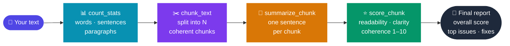

<div align="center">


# TypingFlow Agent

### A Chrome extension that thinks before it speaks

[](https://developer.chrome.com/docs/extensions/mv3/)
[](https://ai.google.dev/)
[](./LICENSE)

Captures text from any field on any page, runs it through a **transparent four-stage AI pipeline**, and delivers a structured writing report — with every tool call visible in a live reasoning chain.

</div>

---

## How It Works



The agent runs this pipeline via **Gemini function calling** — Gemini decides when to call each tool, and the full conversation history is passed on every turn so later stages have complete context.

---

## What You See

```
┌─────────────────────────────────────────────┐
│  🔵 TF  TypingFlow Agent               ⚙   │
├─────────────────────────────────────────────┤
│  CAPTURED TEXT              312 words        │
│  The borrow checker enforces Rust's…         │
│  ↻ Refresh from page                         │
├─────────────────────────────────────────────┤
│  Analyse my writing and give a full report.  │
│                         ▶ Run Agent          │
├─────────────────────────────────────────────┤
│  REASONING CHAIN                             │
│  ├ 📊 count_stats   312 words · 21 sentences │
│  ├ ✂️  chunk_text   3 chunks produced         │
│  ├ 📝 summarize_chunk  "Introduces owner…"   │
│  ├ 📝 summarize_chunk  "Explains borrow…"    │
│  ├ ⭐ score_chunk   R:7  C:5  Co:8  avg:6.7  │
│  └ ⭐ score_chunk   R:8  C:7  Co:9  avg:8.0  │
├─────────────────────────────────────────────┤
│  FINAL REPORT          Overall: 7.1 / 10     │
│  • Clarity weakest — terms undefined in §1   │
│  • Avg sentence length 26 words in §3        │
│                         [ Copy report ]      │
└─────────────────────────────────────────────┘
```

Each card is collapsible — click any step to see the raw args and result JSON.

---

## Tools

| Tool | Type | What it returns |
|---|---|---|
| `count_stats` | ⚡ Local | Words, sentences, paragraphs, avg length, reading time |
| `chunk_text` | ⚡ Local | Array of ≤8 chunks (paragraph → sentence boundary splitting) |
| `summarize_chunk` | 🌐 Gemini | One-sentence distillation per chunk |
| `score_chunk` | 🌐 Gemini | Readability · Clarity · Coherence scores (1–10) + feedback |

---

## Quick Start

```bash
git clone https://github.com/sujitojha1/Gemini-typingflow-agentic.git
```

1. Open `chrome://extensions` → enable **Developer mode** → **Load unpacked** → select the folder
2. Click the **TF** icon → paste your [Gemini API key](https://aistudio.google.com/app/apikey) → **Save**
3. Focus any text field → click **TF** → **↻ Refresh** → **▶ Run Agent**

> Free tier on [Google AI Studio](https://aistudio.google.com) is sufficient.

---

<div align="center">

MIT License · Built with [Gemini 2.0 Flash](https://ai.google.dev/)

</div>
