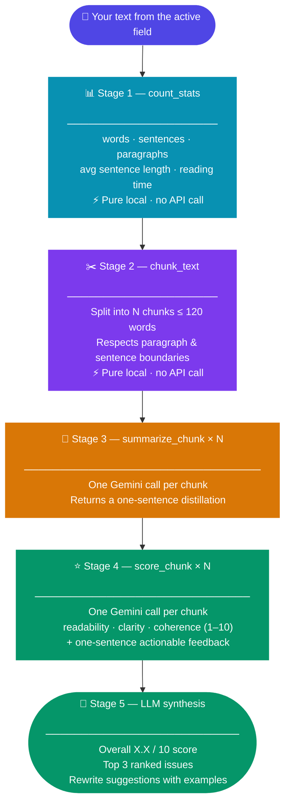

<div align="center">


# TypingFlow Agent

### A Chrome extension that thinks before it speaks

**Powered by Gemini · Built on Manifest V3 · No backend required**

<br>

[](https://developer.chrome.com/docs/extensions/mv3/)
[](https://ai.google.dev/)
[](https://developer.mozilla.org/en-US/docs/Web/JavaScript)
[](./LICENSE)

<br>

> **TypingFlow Agent** captures text from whatever you're typing, runs it through a transparent four-stage AI pipeline — count → chunk → summarise → score — and delivers a structured writing report directly in the page, with every intermediate step visible in a live reasoning chain.

</div>

---

## 📺 How It Looks

```
┌─────────────────────────────────────────────────────┐
│  🔵 TF  TypingFlow Agent                         ⚙  │
├─────────────────────────────────────────────────────┤
│  CAPTURED TEXT                        312 words      │
│ ┌─────────────────────────────────────────────────┐ │
│ │ The borrow checker enforces Rust's ownership    │ │
│ │ model at compile time. Every value has a sin…   │ │
│ └─────────────────────────────────────────────────┘ │
│  ↻ Refresh from page                                 │
├─────────────────────────────────────────────────────┤
│  Analyse my writing and give a full report.          │
│                              ▶ Run Agent             │
├─────────────────────────────────────────────────────┤
│  REASONING CHAIN                                     │
│                                                      │
│  ├📊 count_stats   312 words · 21 sentences    ▾    │
│  ├✂️  chunk_text   3 chunks produced            ▾    │
│  ├📝 summarize_chunk  "Introduces ownership…"  ▾    │
│  ├📝 summarize_chunk  "Explains borrow rules…" ▾    │
│  ├📝 summarize_chunk  "Contrasts with GC…"     ▾    │
│  ├⭐ score_chunk   R:7  C:5  Co:8  avg:6.7     ▾    │
│  ├⭐ score_chunk   R:8  C:7  Co:9  avg:8.0     ▾    │
│  └⭐ score_chunk   R:6  C:6  Co:7  avg:6.3     ▾    │
│                                                      │
├─────────────────────────────────────────────────────┤
│  FINAL REPORT                                        │
│ ┌─────────────────────────────────────────────────┐ │
│ │ ## Overall Score: 7.0 / 10                      │ │
│ │                                                  │ │
│ │ **Top Issues**                                   │ │
│ │ • Clarity (avg 6.0) — terms introduced without  │ │
│ │   definition in chunks 1 and 3                  │ │
│ │ • Chunk 3 readability dips to 6 — sentences     │ │
│ │   exceed 25 words on average                    │ │
│ │                                                  │ │
│ │ **Suggestions**                                  │ │
│ │ Before: "The borrow checker enforces…"           │ │
│ │ After:  "Rust's borrow checker — the part of    │ │
│ │          the compiler that enforces…"            │ │
│ └─────────────────────────────────────────────────┘ │
│  [ Copy report ]          [ New analysis ]           │
└─────────────────────────────────────────────────────┘
```

---

## ✨ Features

| | Feature | Detail |
|---|---|---|
| 🔗 | **Works on any page** | Injects into Gmail, Notion, Google Docs, LinkedIn — any text field |
| 🤖 | **True agentic loop** | Gemini decides which tools to call; full message history passed on every turn |
| 🪟 | **Live reasoning chain** | Every tool call appears as a collapsible card the moment it completes |
| 🛠️ | **Four custom tools** | `count_stats` · `chunk_text` · `summarize_chunk` · `score_chunk` |
| 🔒 | **No backend** | All API calls run from the service worker; API key stays in your browser |
| 🌙 | **Dark mode** | Follows your OS preference automatically |
| 📋 | **One-click copy** | Inserts the final report back into the originating text field |

---

## 🏗️ The Pipeline

Every run follows the same five-stage sequence. The LLM only synthesises commentary **after** all four tool stages are complete — it cannot skip ahead.



---

## 🛠️ Tool Reference

### 📊 `count_stats` — Baseline metrics

> Pure JavaScript · zero network calls · runs first, always

```js
count_stats({ text: "Your full draft..." })
// → { word_count: 312, sentence_count: 21, paragraph_count: 6,
//     avg_sentence_length: 14.9, reading_time_sec: 75 }
```

Grounds the model in concrete numbers so it cannot hallucinate statistics about your text.

---

### ✂️ `chunk_text` — Semantic splitting

> Pure JavaScript · zero network calls · respects paragraph & sentence boundaries

```js
chunk_text({ text: "...", max_words: 120 })
// → { chunks: ["Chunk one...", "Chunk two...", "Chunk three..."] }
```

Splits at paragraph breaks first, then falls back to sentence boundaries (uppercase-aware to preserve abbreviations like "Dr." and "U.S.A."). Hard cap of 8 chunks prevents context overflow.

---

### 📝 `summarize_chunk` — Per-chunk distillation

> One focused Gemini call per chunk · 15 s timeout · temperature 0.2

```js
summarize_chunk({ chunk: "The borrow checker enforces..." })
// → { summary: "Introduces Rust's ownership model and its compile-time guarantees." }
```

Gives the model (and you) a structural map of the text before scoring begins.

---

### ⭐ `score_chunk` — Per-chunk scoring

> One focused Gemini call per chunk · 15 s timeout · temperature 0.1 · scores clamped to [0, 10]

```js
score_chunk({ chunk: "The borrow checker enforces..." })
// → { readability: 7, clarity: 5, coherence: 8,
//     feedback: "Term 'borrow checker' introduced without a brief definition." }
```

The highest-signal output for the writer. All three dimensions are scored independently; the final report averages them across all chunks to produce an overall score.

---

## 🔄 Agent Loop

The agent is a standard Gemini multi-turn conversation. **The entire `messages` array grows on every iteration** — no truncation, no summarisation — so later stages always have full context of earlier results.

```
messages = [{ role: "user", parts: [systemPrompt + captured text] }]

while iterations < 30 and elapsed < 120 s:
  POST /generateContent  ← full messages + 4 tool declarations
  │
  ├── response has functionCall parts?
  │     for each call:
  │       result = dispatchTool(name, args)      ← local or Gemini sub-call
  │       stream AGENT_STEP event → panel card
  │     append model turn + all functionResponse parts
  │     continue loop
  │
  └── response has only text?
        stream AGENT_DONE event → final report
        stop
```

Connections between stages flow naturally through conversation history — no hand-crafted state machine required.

---

## ⚡ Quick Start

### 1 · Clone

```bash
git clone https://github.com/sujitojha1/Gemini-typingflow-agentic.git
cd Gemini-typingflow-agentic
```

### 2 · Load in Chrome

1. Open **`chrome://extensions`**
2. Enable **Developer mode** (top-right toggle)
3. Click **Load unpacked** → select the repo folder
4. The **TF** icon appears in your toolbar ✓

### 3 · Add your API key

1. Click the **TF** icon on any page
2. Paste your [Gemini API key](https://aistudio.google.com/app/apikey) → **Save & Continue**

> **Free tier is enough.** Gemini 2.0 Flash has a generous free quota via Google AI Studio.

### 4 · Analyse your writing

1. Click inside any text field (Gmail, Notion, a form — anything)
2. Click the **TF** icon → panel slides open
3. Click **↻ Refresh** to capture the text
4. Type a prompt or just press **▶ Run Agent**
5. Watch the reasoning chain fill in — expand any card to see raw args & results
6. Click **Copy report** to paste the analysis back into the field

---

## 📁 Project Structure

```
Gemini-typingflow-agentic/
│
├── manifest.json          MV3 manifest — permissions, service worker, CSP
│
├── background.js          Service worker
│                          • Gemini agent loop (30-iter cap, 120 s timeout)
│                          • Tool dispatch
│                          • Tab ↔ panel message relay
│
├── content.js             Page-side script
│                          • Tracks last focused text field
│                          • Injects and toggles panel iframe
│                          • Bridges page ↔ background messaging
│
├── panel/
│   ├── panel.html         Two-view layout: setup + main
│   ├── panel.js           Reasoning chain renderer, score grids, report
│   └── panel.css          Design system with full dark mode support
│
├── tools/
│   ├── tools.js           Schema barrel + dispatchTool()
│   ├── count_stats.js     ⚡ Pure local — word/sentence/paragraph metrics
│   ├── chunk_text.js      ⚡ Pure local — paragraph-aware text splitter
│   ├── summarize_chunk.js 🌐 Gemini sub-call — one-sentence summary
│   └── score_chunk.js     🌐 Gemini sub-call — three-dimension scorer
│
└── icons/
    └── icon.svg
```

---

## 🔒 Security Notes

- **API key stored locally** — saved in `chrome.storage.local`, never leaves your browser except in request headers sent directly to Google's API
- **Key sent as a header** — `x-goog-api-key`, not as a URL query parameter (no key in browser history or proxy logs)
- **Locked postMessage origin** — content script only accepts messages from the known `chrome-extension://` origin of the panel iframe
- **No eval, no innerHTML injection** — all user text is HTML-escaped before rendering; score JSON is regex-extracted and schema-validated before use

---

## 🧩 Extension Permissions

| Permission | Why it's needed |
|---|---|
| `storage` | Save and retrieve the Gemini API key |
| `activeTab` | Read the URL of the current tab when the icon is clicked |
| `scripting` | Inject `content.js` on demand if not yet loaded |
| `tabs` | Send `AGENT_STEP` / `AGENT_DONE` messages back to the correct tab |

---

## 🗺️ Roadmap

- [ ] **Phase 6** — End-to-end test suite (6 scenarios)
- [ ] **Phase 7** — YouTube demo + LLM log export + `v1.0.0` tag
- [ ] Streaming token output for the final report
- [ ] Adjustable chunk size via panel settings
- [ ] Export report as Markdown file
- [ ] Firefox / Edge port (Manifest V3 compatible)

---

## 🤝 Contributing

1. Fork the repo and create a branch: `git checkout -b feature/your-idea`
2. Make changes, load the unpacked extension in Chrome to test
3. Open a pull request describing what you changed and why

All contributions welcome — new tools, UI improvements, test coverage, docs.

---

<div align="center">

Built with ❤️ and [Gemini 2.0 Flash](https://ai.google.dev/) &nbsp;·&nbsp; MIT License

</div>
